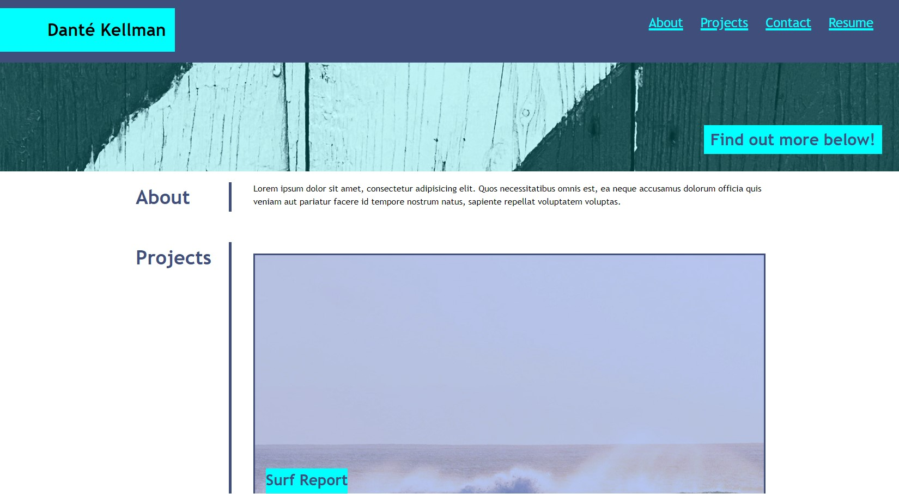

# Alternative Portfolio

## Description

This portfolio's purpose, is to showcase my skills and talents to employers looking to fill a part-time or full-time position. This website is to hold all of the web applications I build to show my capabilities. This project will hopefully enable me to standout to employers, so I don't have to just rely on my CV/Resume.

Whilst doing this project, I have learnt about HTML, CSS Grids, CSS flexbox, media queries, and CSS variables. 

## Installation

Using thr live link will enable you to use this application.

## Usage

The website is easy to use. It has 4 navigation links at the top: About Me, Work, Contact Me and Resume. The first three links can be clicked and the website will scroll down to that specific section. The Resume link willl take you to another tab, where you'll be able to view my Resume. In the Work section there are 5 projects. When clicking on the project, it will take you top that specific site. In the contact me section there are 5 options. My number, my email (clicking on this will take you to a new tab) and my social links which inlcude Linkedin, GitHub and Twitter. Clicking on any of the three will take you to a new tab.

Below is a screenshot of my portfolio:

    ```md
    
    ```

## Credits

N/A

## License

Please refer to the license in the repo.